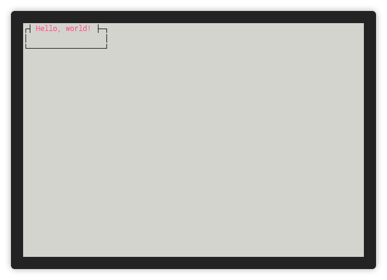

<h1 align="center">Welcome to cursive-aligned-view 👋</h1>
<p align="center">
  <a href="https://travis-ci.org/deinstapel/cursive-aligned-view">
    
  </a>
  <a href="https://travis-ci.org/deinstapel/cursive-aligned-view">
    
  </a>
  <a href="https://crates.io/crates/cursive-aligned-view">
    
  </a>
  <a href="https://docs.rs/cursive-aligned-view">
    
  </a>
  <a href="https://github.com/deinstapel/cursive-aligned-view/blob/master/LICENSE">
    
  </a>
  <a href="http://makeapullrequest.com">
    
  </a>
  <br>
  <i>A view wrapper for
  <a href="https://github.com/gyscos/cursive">gyscos/cursive</a>
  views which aligns child views</i>
</p>

---

This project provides an `AlignedView` for [gyscos/cursive](https://github.com/gyscos/cursive) views which makes it possible to align the child view (center, left, right, top, bottom). The `AlignedView` uses the `required_size` reported by the child view and fills the rest of the available space with the views background color.

## How does it look like? `demo` [](https://github.com/faressoft/terminalizer)

<details>
  <summary>Expand to view</summary>
  
</details>

## Usage

Simply add to your `Cargo.toml`

```toml
[dependencies]
cursive-aligned-view = "^0"
```

### Aligning a child view

The easiest way to align a view is via the `Alignable` trait:

```rust
use cursive_aligned_view::Alignable;

let aligned = child_view.align_center();
```

This is the preferred way as it is *chainable* and consistent with cursive's `Boxable` and `Identifiable` traits.

As an alternative you can use the `AlignedView` constructors directly:

```rust
use cursive_aligned_view::AlignedView;

let aligned = AlignedView::center(child_view);
```

Look into the [documentation](https://docs.rs/cursive-aligned-view) for a detailed explanation on the API.

### Supported Alignments

| Alignment     | Construction method   |
|---------------|-----------------------|
| top left      | `align_top_left`      |
| top center    | `align_top_center`    |
| top right     | `align_top_right`     |
| center left   | `align_center_left`   |
| center        | `align_center`        |
| center right  | `align_center_right`  |
| bottom left   | `align_bottom_left`   |
| bottom center | `align_bottom_center` |
| bottom right  | `align_bottom_right`  |

## Troubleshooting

If you find any bugs/unexpected behaviour or you have a proposition for future changes open an issue describing the current behaviour and what you expected.

## Development [](https://travis-ci.org/deinstapel/cursive-aligned-view) [](https://github.com/fin-ger/shellshot)

### Running the tests

> :bangbang: **CAUTION** :bangbang: This crate uses Tmux for end2end testing and will **kill your Tmux server** during testing!

#### Preparing integration tests

In order to run the integration tests, you first need to install a recent version of `>=npm-10` and `>=tmux-2.6`!

After `npm` and `tmux` are installed, install required dependencies:

```
$ ./scripts/prepare-end2end-tests.sh
```

This will use `npm` to install `jest` and `shellshot` in the `tests` folder.

#### Running all test suites

Just run

```
$ cargo test
```

to execute all available tests.

#### shields.io endpoints

[shields.io](https://shields.io) endpoints are generated inside the `./target/shields` folder. They are used in this README.

### Public API naming

The current public API of this crate is not consistent with [RFC 344](https://github.com/rust-lang/rfcs/pull/344). This is due to `cursive` itself not being
consistent with `RFC 344`. This crate tries to implement a smooth user experience for cursive
users. Therefore, the `cursive` naming convention was adapted. When `cursive` upstream converts
their API to a `RFC 344` consistent naming scheme, this crate will adapt to the changes.

## Authors

**Fin Christensen**

> [:octocat: `@fin-ger`](https://github.com/fin-ger)  
> [:elephant: `@fin_ger@mastodon.social`](https://mastodon.social/web/accounts/787945)  
> [:bird: `@fin_ger_github`](https://twitter.com/fin_ger_github)  

<br>

**Johannes Wünsche**

> [:octocat: `@jwuensche`](https://github.com/jwuensche)  
> [:elephant: `@fredowald@mastodon.social`](https://mastodon.social/web/accounts/843376)  
> [:bird: `@Fredowald`](https://twitter.com/fredowald)  

## Show your support

Give a :star: if this project helped you!
